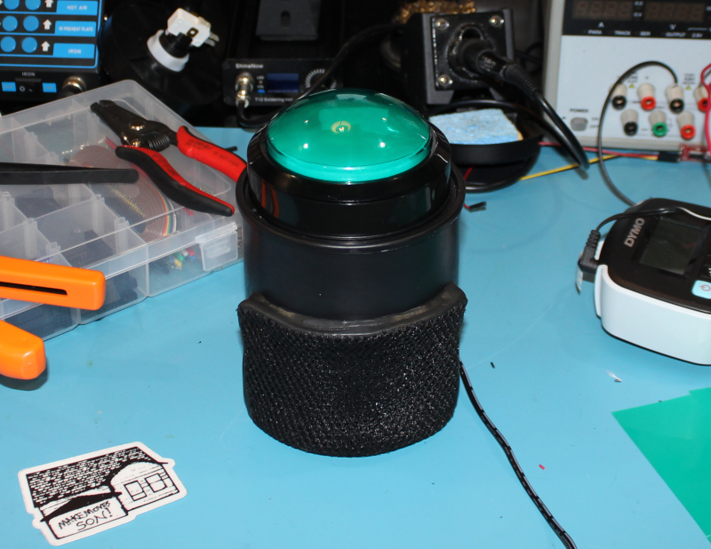
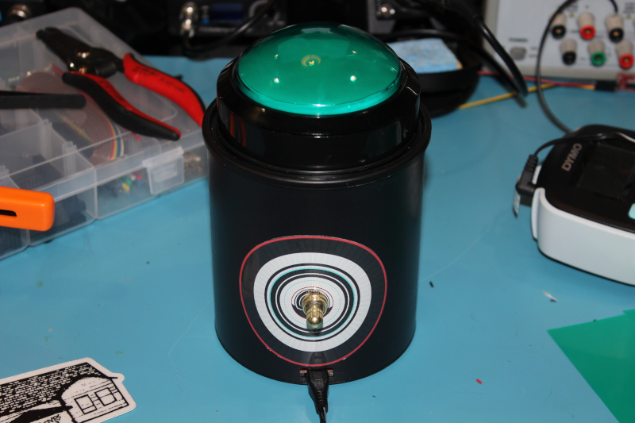

This is the meta-owswaas Yocto layer, which implements 
Owen Wilson Saying "Wow" as a Service (OWSWaaS) on this hot mess:

You can see a [video of it in action here](https://youtu.be/Z1xaM5WDDfk).

If you haven't used Yocto before, you can find a quick intro here:
https://github.com/jynik/ready-set-yocto

Dependencies
============

This layer depends on:

  URI: git://git.yoctoproject.org/poky.git
  layers: meta, meta-poky
  branch: zeus

  URI: https://github.com/agherzan/meta-raspberrypi.git
  layers: meta-raspberrypi
  branch: zeus

  URL: git://git.openembedded.org/meta-openembedded
  layers: meta-oe, meta-multimedia, meta-networking, meta-python, meta-filesystems
  branch: zeus

Configuration Variables
=======================

This layer currently targets the Raspberry Pi Zero (W), but can easily be adapted
to other platforms by defining variable overrides for the following in your `local.conf`.

*Sysfs GPIO pin assigments*

* `GPIO_BTN = "24"` - Push button
* `GPIO_SW  = "23"` - SP/ST rotary switch
* `GPIO_LED = "18"` - LED control (intentionally on RPi PWM pin, though not used as such)

*Default ALSA sound card selection, by index:*

`DEFAULT_ALSA_CARD = "0"`

Hardware
========

This is a fairly simple setup, and makes for a fun beginner/intermediate hobbyist
electronics project. Information about the hardware components can be found here:

* [Pictures](./doc/images/)
* [Schematic](./doc/owswaas-shield.pdf)
* [Bill of Materials](./doc/BOM.md)

Patches
=======

Please submit patches as pull requests on Github at:
https://github.com/jynik/meta-owswaas/pulls
